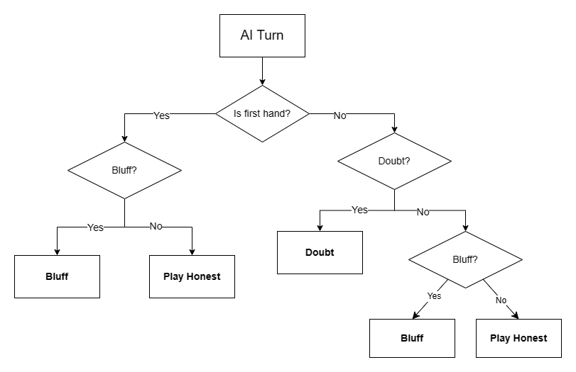
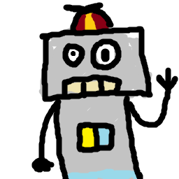
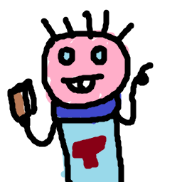
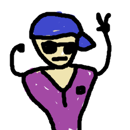
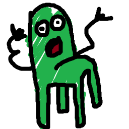
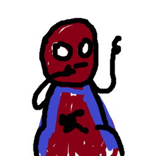
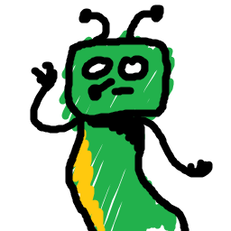
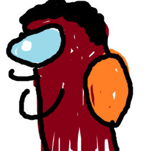

# Introduction

The objective of this project was to determine the most proficient AI for playing Dubito. Within this endeavor, you'll discover both the game itself and the framework for conducting numerous experiments involving various AI players.

# The Game
**Dubito** is a dynamic card game designed for 3-8 players. To kick off the game, cards are distributed in a round-robin fashion, starting with the initiating player. 

Each turn, players have the option to either make a play or doubt the previous player's move. If there are no cards on the table, players are limited to making a play. When making a play, a player can choose to place 1-3 cards face down and declare a number (ranging from 1 to King). A truthful play occurs when the declared number matches the cards placed (e.g., declaring "1" and placing two cards of value 1), while any other declaration constitutes a bluff.

Alternatively, players can opt to doubt the previous player's claim. If the previous player was indeed bluffing, they collect all cards on the table, and the doubting player proceeds with their turn. Conversely, if the previous player was truthful, the doubting player collects all cards on the table, and the game continues with the next player.

The game culminates when only two players remain, resulting in the elimination of those two players and victory for the remaining participants.

# Simplifications

To reduce the complexity of the experiments, certain simplifications were implemented:

- **Number of winner**: Limited to a single winner, as scenarios with multiple winners in a single game are treated as recursive instances of the "One winner case".
- **No jollies**: In order to reduce AI complexity.

# AI
The AI comprises a straightforward tree structure that delineates various turn scenarios in Dubito based on provided information.

## Input

To enable well-informed decision-making, a dictionary is conveyed to the AI at each turn. This dictionary contains the following information:

- **hand**: the cards of the current player

- **board_cards**: number of cards in the board (0 means you're the first)
- **playing_cards**: all numbers without discarded cards
- **current_number**: the card number called from the previous player (0 means you're the first)
- **n_cards_played**: number of cards played by the previous player
- **streak** : Number of turns without doubts
- **prev**: information about previous player
  - **n_cards**: amount of cards of this player
  - **turns**: how many turns the player played
  - **not_first_turns**: how many turns the player played (not first hand)
  - **doubts**: number of times the player doubted
  - **honest_times**: number of times recorded that this player was honest when doubted
  - **dishonest_times**: number of times recorded that this player was dishonest when doubted
- **next**: information about next player
  - **n_cards**: amount of cards of this player
  - **turns**: how many turns the player played
  - **not_first_turns**: how many turns the player played (not first hand)
  - **doubts**: number of times the player doubted
  - **honest_times**: number of times recorded that this player was honest when doubted
  - **dishonest_times**: number of times recorded that this player was dishonest when doubted

e.g. {'board_cards': 1,
 'current_number': 1,
 'n_cards_played': 1,
 'streak' : 1,
 'next': {'n_cards': 5,
          'dishonest_times': 0,
          'doubts': 8,
          'honest_times': 0,
          'id': 1,
          'not_first_turns': 10,
          'turns': 16},
 'playing_cards': [1, 7, 10, 11, 13],
 'prev': {'n_cards': 7,
          'dishonest_times': 1,
          'doubts': 0,
          'honest_times': 1,
          'id': 2,
          'not_first_turns': 8,
          'turns': 12}}

## Output

Instead, the output is a clearly defined dictionary containing three keys:

- **doubt**: boolean, can be either true or false
- **number**: represent the number that the player want to pick (only when he is first hand)
- **cards**: represent the cards the player want to play

e.g. {
'doubt': False,
'number': random.choice(input_player['playing_cards']),
'cards': picked_cards 
}

# Personalized AI

The aim of this project is to attempt to create AIs that achieve better results than other bots. Let's see how to accomplish this.

## Create your AI
To create your AI, you need to create a class that extends the PlayerAI class. Examples are provided within the scripts `bots/probability.py` and `bots/rule_based.py`. As shown in the previous image, it is necessary to divide the bot's move into two parts: 

- If it's **the first to play**: then it must play cards (in other words, it cannot doubt).
- If it's **not the first to play**: in this case, the player has free choice: to doubt or to play cards.

## Test your AI

To test your AI, refer to `experiments.py`. Import your bot and add it to the ALGORITHM list. Then execute the script using `python experiments.py`; the results will be saved in `all_games.yaml`. Additionally, you can generate various plots using `graphs/stats.py`.

# Experiments

This is a multiplayer game, so it's complex to have a general score to associate with a bot. However, we can rely on a relative value (a bot's strength also depends on its opponents), and it's also possible to see which bots each one performs well against. My strategy for evaluating the bots is to play a very large number of games (1 million) and collect statistics along the way (for more information, refer to `experiments.py` and `handlers.py`).

## Bots

Here you'll find a comprehensive list of all the bots utilized in this experiment, followed by an assessment of their performance.

    
    

        
<b>RandomBoi</b>

    

- In the **initial hand**, decides with a 50% chance whether to bluff or play honestly.
- In the **regular hands**: 
  - if it can play seriously, it has a 33% chance of playing honestly, bluffing, or doubting; 
  - otherwise, it has a 50% chance of bluffing or doubting.
Plays one card at a time.

    
    

        
<b>AlwaysTruthful</b>

    

- In the **initial hand** play truthfully.
- In the **regular hands**: 
  - if can play truthfully, play truthfully; 
  - otherwise, doubt.
Tries to maximize the amout of cards played

    
    

        
<b>MrNoDoubt</b>

    

- In the **initial hand** play truthfully.
- In the **regular hands**: 
  - if can play truthfully, play truthfully; 
  - otherwise, bluffs.
Tries to maximize the amout of cards played

    
    

        
<b>JustPutCards</b>

    

- In the **initial hand** bluffs placing 3 random cards.
- In the **regular hands**: bluffs placing 3 random cards.
Tries to maximize the amout of cards played

    
    

        
<b>MrDoubt</b>

    

- In the **initial hand** decides with a 50% chance whether to bluff or play honestly.
- In the **regular hands** doubt.
Tries to maximize the amout of cards played

    
    

        
<b>AdaptyBoi</b>

    

Tailors its gameplay based on the players around it.
- In the **initial hand**, if the next player doubts a lot, then it will play honestly; otherwise, it will try to bluff.
- In the **regular hands**, it tries to determine if the previous player is honest:
    - If the previous player is honest, it tries to see if the next player doubts a lot:
        - If the next player doubts a lot, then it tries to see if it can play honestly:
            - If it can play honestly, it will do so.
            - Otherwise, it will choose whether to bluff or doubt based on the higher probability between the next player doubting and the previous player playing honestly.
        - Otherwise, it bluffs.
    - Otherwise, it doubts.

    
    

        
<b>SusBoi</b>

    

- In the **initial hand** there is a 67% probability of bluffing otherwise is honest
- In the **regular hands** Doubt with higher probability  if the previous player plays a lot of cards (0.3 for 1 card, 0.6 for 2 card and 0.9 for 3 cards) otherwise there is a 67% probability of bluffing otherwise is honest.

    
    

        
<b>RiskCounter</b>

    

Aggressive when the streak is low otherwise Honest. Calculates the risk value considering: the number of cards held by the next player, the number of cards held by the bot, and the streak.

    
    

        
<b>StefaBot</b>

    

- If prev_player was playing first turn, then doubt
- If prev_player was not playing first turn then check the number of cards of prev_player
  - if prev_player has played 3 cards doubt,
  - otherwise then with 50% probability be honest or doubt 