# Introduction

The objective of this project was to determine the **most proficient AI for playing Dubito**. Within this endeavor, you'll discover both the game itself and the framework for conducting numerous experiments involving various AI players.

# The Game
**Dubito** is a dynamic card game designed for 3-8 players. To kick off the game, cards are distributed in a round-robin fashion, starting with the initiating player. 

Each turn, players have the option to either make a play or doubt the previous player's move. If there are no cards on the table, players are limited to making a play. When making a play, a player can choose to place 1-3 cards face down and declare a number (ranging from 1 to King). A truthful play occurs when the declared number matches the cards placed (e.g., declaring "1" and placing two cards of value 1), while any other declaration constitutes a bluff.

Alternatively, players can opt to doubt the previous player's claim. If the previous player was indeed bluffing, they collect all cards on the table, and the doubting player proceeds with their turn. Conversely, if the previous player was truthful, the doubting player collects all cards on the table, and the game continues with the next player.

The game culminates when only two players remain, resulting in the elimination of those two players and victory for the remaining participants.

# Simplifications

To reduce the complexity of the experiments, certain simplifications were implemented:

- **Number of winner**: Limited to a single winner, as scenarios with multiple winners in a single game are treated as recursive instances of the "One winner case".
- **Jokers**: 2 jokers (value `0`) are included. A joker acts as any card; if doubted while a joker was played, the joker is discarded and the remaining board cards go to the doubter. Jokers already accumulated in the board pile are kept by whoever picks it up.

# AI

## Decision Tree

Every bot turn follows this exact structure. The lettered nodes **(A–E)** are the only points where strategy matters — everything else is forced by the rules.

```
MY TURN
│
├─ First hand? (board_cards == 0)
│   │
│   ├─ YES ──► Must play cards (doubting is illegal)
│   │           ├─ [A] Bluff or Honest?
│   │           │       BLUFF  → pick any cards, declare a random number
│   │           │       HONEST → pick cards from hand, declare their value
│   │           └─ [B] How many cards to play? (1, 2, or 3)
│   │
│   └─ NO ───► Regular turn
│               │
│               ├─ [C] Doubt or Play?
│               │
│               ├─ if Doubt ──► challenge prev player's last move
│               │
│               └─ if Play
│                   ├─ Can play truthfully?  (do I hold the current number?)
│                   │   ├─ YES ──► [D] Bluff or Honest?
│                   │   │               BLUFF  → pick any cards
│                   │   │               HONEST → pick matching cards
│                   │   └─ NO  ──► forced to Bluff (pick any cards)
│                   │
│                   └─ [E] How many cards to play? (1, 2, or 3)
```

Every bot is a specific strategy for answering **A–E**. The available signals to inform those answers are:

| Signal | Informs | What it tells you |
|---|---|---|
| `dishonest_times(prev_id, history)` / `honest_times(prev_id, history)` | C | Prev player's historical honesty ratio when doubted |
| `n_cards_played` | C | Cards prev just played (1–3); more cards = more suspicious |
| `player_card_counts[prev_player_id]` | C | Prev's remaining cards; 0 means they're about to win → doubt |
| `prev_player_started_turn` | C | Prev set the number this round (they went first) |
| `streak` | C, E | Turns without a doubt; longer = larger pile on the board |
| `doubts_count(next_id, history)` / `turns_count(next_id, history)` | A, D, E | How aggressively the next player doubts; affects how safe you need to be |
| `player_card_counts[next_player_id]` | C, E | Next player's remaining cards |
| `history` (DoubtResolvedEvent.latest_cards) | all | Actual cards revealed in past doubt resolutions — which numbers each player was holding |
| Own hand (`my_cards`) | A, B, D, E | Which numbers you hold and how many of each |

## Input

At each turn the bot receives a `TurnData` dataclass. It has two parts: a **certain snapshot** of the current game state, and a **raw history** of all events from which anything uncertain must be derived.

**Certain snapshot** — engine-verified facts

| Field | Type | Description |
|---|---|---|
| `my_cards` | `list[int]` | Your current hand (private) |
| `current_number` | `int` | Number declared by the previous player (0 on first hand) |
| `board_cards` | `int` | Total cards on the board |
| `n_cards_played` | `int` | How many cards the previous player placed |
| `playing_cards` | `list[int]` | Card numbers still in circulation (not globally discarded) |
| `n_players` | `int` | Number of players still active |
| `player_card_counts` | `dict[int, int]` | Exact card count per player id |
| `streak` | `int` | Consecutive turns without a doubt |
| `my_player_id` | `int` | Your player id |
| `prev_player_id` | `int` | Id of the player before you |
| `next_player_id` | `int` | Id of the player after you |

**History** — raw event log for inference

| Field | Type | Description |
|---|---|---|
| `history` | `list[GameEvent]` | All events since game start, in order |

The event types are:

| Event | Key fields | What it reveals |
|---|---|---|
| `GameStartEvent` | `player_ids`, `initial_card_counts` | Starting configuration |
| `CardsPlayedEvent` | `player_id`, `declared_number`, `n_cards` | Who played, what they claimed, how many cards |
| `DoubtResolvedEvent` | `doubter_id`, `target_id`, `correct`, `latest_cards`, `declared_number` | The actual cards that were face-down — revealed on doubt |
| `DiscardEvent` | `player_id`, `card_number` | Which number was discarded (4-of-a-kind removed) |
| `PlayerWonEvent` | `player_id`, `position` | Who finished and in what place |

`game_data.py` exports four helper functions for the most common history queries:

```python
from dubito.game_data import honest_times, dishonest_times, doubts_count, turns_count

honest_times(player_id, history)    # times player was doubted and found honest
dishonest_times(player_id, history) # times player was caught bluffing
doubts_count(player_id, history)    # times player chose to doubt
turns_count(player_id, history)     # total turns taken (plays + doubts)
```


## Output

Each bot returns a `TurnOutput` dataclass:

| Field | Type | Description |
|---|---|---|
| `doubt` | `bool` | `True` to challenge the previous player, `False` to play cards |
| `number` | `Optional[int]` | Declared number — only set when opening a new round (first hand) |
| `cards` | `Optional[List[int]]` | Cards placed face-down — `None` when doubting |

# Personalized AI

The aim of this project is to attempt to create AIs that achieve better results than other bots. Let's see how to accomplish this.

## Create your AI
To create your AI, you need to create a class that extends the PlayerAI class. Examples are provided within the scripts `bots/probability.py` and `bots/rule_based.py`. As shown in the previous image, it is necessary to divide the bot's move into two parts: 

- If it's **the first to play**: then it must play cards (in other words, it cannot doubt).
- If it's **not the first to play**: in this case, the player has free choice: to doubt or to play cards.

## Test your AI

To test your AI, refer to `experiments.py`. Import your bot and add it to the ALGORITHM list. Then execute the script using `python experiments.py`; the results will be saved in `all_games.yaml`. Additionally, you can generate various plots using `graphs/stats.py`.

# Experiments

This is a multiplayer game, so it's complex to have a general score to associate with a bot. However, we can rely on a relative value (a bot's strength also depends on its opponents), and it's also possible to see which bots each one performs well against. My strategy for evaluating the bots is to play a very large number of games (1 million) and collect statistics along the way (for more information, refer to `experiments.py` and `handlers.py`).

## Bots

Here you'll find a comprehensive list of all the bots utilized in this experiment, followed by an assessment of their performance.

<div style="display: flex; align-items: center; margin-top: 40px; margin-bottom: 5px;">
    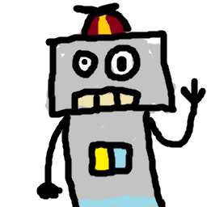
    <div style="margin-left: 20px; font-size: 32px;">
        <p><b>RandomBoi</b></p>
    </div>
</div>

- In the **initial hand**, decides with a 50% chance whether to bluff or play honestly.
- In the **regular hands**: 
  - if it can play seriously, it has a 33% chance of playing honestly, bluffing, or doubting; 
  - otherwise, it has a 50% chance of bluffing or doubting.
Plays one card at a time.

<div style="display: flex; align-items: center; margin-top: 40px; margin-bottom: 5px;">
    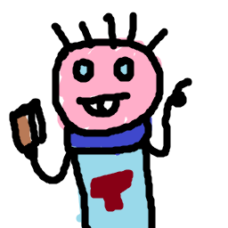
    <div style="margin-left: 20px; font-size: 32px;">
        <p><b>AlwaysTruthful</b></p>
    </div>
</div>

- In the **initial hand** play truthfully.
- In the **regular hands**: 
  - if can play truthfully, play truthfully; 
  - otherwise, doubt.
Tries to maximize the amout of cards played

<div style="display: flex; align-items: center; margin-top: 40px; margin-bottom: 5px;">
    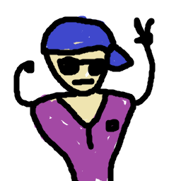
    <div style="margin-left: 20px; font-size: 32px;">
        <p><b>MrNoDoubt</b></p>
    </div>
</div>

- In the **initial hand** play truthfully.
- In the **regular hands**: 
  - if can play truthfully, play truthfully; 
  - otherwise, bluffs.
Tries to maximize the amout of cards played

<div style="display: flex; align-items: center; margin-top: 40px; margin-bottom: 5px;">
    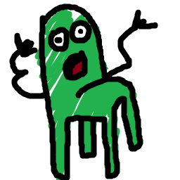
    <div style="margin-left: 20px; font-size: 32px;">
        <p><b>JustPutCards</b></p>
    </div>
</div>

- In the **initial hand** bluffs placing 3 random cards.
- In the **regular hands**: bluffs placing 3 random cards.
Tries to maximize the amout of cards played

<div style="display: flex; align-items: center; margin-top: 40px; margin-bottom: 5px;">
    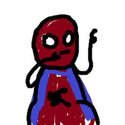
    <div style="margin-left: 20px; font-size: 32px;">
        <p><b>MrDoubt</b></p>
    </div>
</div>

- In the **initial hand** decides with a 50% chance whether to bluff or play honestly.
- In the **regular hands** doubt.
Tries to maximize the amout of cards played

<div style="display: flex; align-items: center; margin-top: 40px; margin-bottom: 5px;">
    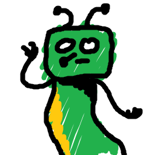
    <div style="margin-left: 20px; font-size: 32px;">
        <p><b>AdaptyBoi</b></p>
    </div>
</div>

Tailors its gameplay based on the players around it.
- In the **initial hand**, if the next player doubts a lot, then it will play honestly; otherwise, it will try to bluff.
- In the **regular hands**, it tries to determine if the previous player is honest:
    - If the previous player is honest, it tries to see if the next player doubts a lot:
        - If the next player doubts a lot, then it tries to see if it can play honestly:
            - If it can play honestly, it will do so.
            - Otherwise, it will choose whether to bluff or doubt based on the higher probability between the next player doubting and the previous player playing honestly.
        - Otherwise, it bluffs.
    - Otherwise, it doubts.

<div style="display: flex; align-items: center; margin-top: 40px; margin-bottom: 5px;">
    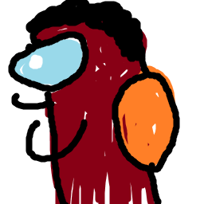
    <div style="margin-left: 20px; font-size: 32px;">
        <p><b>SusBoi</b></p>
    </div>
</div>

- In the **initial hand** there is a 67% probability of bluffing otherwise is honest
- In the **regular hands** Doubt with higher probability  if the previous player plays a lot of cards (0.3 for 1 card, 0.6 for 2 card and 0.9 for 3 cards) otherwise there is a 67% probability of bluffing otherwise is honest.

<div style="display: flex; align-items: center; margin-top: 40px; margin-bottom: 5px;">
    
    <div style="margin-left: 20px; font-size: 32px;">
        <p><b>RiskCounter</b></p>
    </div>
</div>

Aggressive when the streak is low otherwise Honest. Calculates the risk value considering: the number of cards held by the next player, the number of cards held by the bot, and the streak.

<div style="display: flex; align-items: center; margin-top: 40px; margin-bottom: 5px;">
    
    <div style="margin-left: 20px; font-size: 32px;">
        <p><b>StefaBot</b></p>
    </div>
</div>

- If prev_player was playing first turn, then doubt
- If prev_player was not playing first turn then check the number of cards of prev_player
  - if prev_player has played 3 cards doubt,
  - otherwise then with 50% probability be honest or doubt

<div style="display: flex; align-items: center; margin-top: 40px; margin-bottom: 5px;">
    <div style="margin-left: 20px; font-size: 32px;">
        <p><b>ClaudeBot</b></p>
    </div>
</div>

A score-based bot that tries to make the mathematically correct decision at each node.

- In the **initial hand**, always plays honestly and maximizes cards played. Concretely: picks all cards of the most-common number in its hand and declares that number. Zero risk, maximum card removal.

- In the **regular hands**, decides whether to doubt using a **suspicion score**:

  ```
  suspicion = 0.5 × prev_dishonesty_rate + 0.5 × card_suspicion

  card_suspicion:  1 card played → 0.05  (not suspicious)
                   2 cards played → 0.30
                   3 cards played → 0.65  (very suspicious)
  ```

  If prev started the round (they picked the number themselves), `card_suspicion` is cut to 40% — they were more likely to have that number.

  The doubt threshold then scales with how many cards ClaudeBot is currently holding:

  | My card count | Threshold | Reasoning |
  |---|---|---|
  | ≤ 4 | 0.75 | Nearly winning — stay safe, avoid picking up cards |
  | 5–17 | 0.50 | Balanced play |
  | ≥ 18 | 0.30 | Already drowning in cards — be aggressive |

  Additionally: if prev has **0 cards** (they are about to win), it always doubts regardless of score.

  If ClaudeBot **cannot play truthfully** anyway, the threshold is lowered by 0.15 — if it has to bluff, doubting is sometimes the better gamble.

- **Bluffing** (node D — only when honest play is also possible): ClaudeBot bluffs only when two conditions are both true:
  1. The next player's doubt rate is **below 35%** (they're unlikely to catch the bluff)
  2. ClaudeBot has **fewer than 3 matching cards** — because bluffing always plays 3 random cards, while honest play only dumps the matching ones. If there are fewer than 3 matches, bluffing removes *more* cards for the same risk.

- Always **maximizes** cards played.


# Result

The overall results are depicted on this plot.

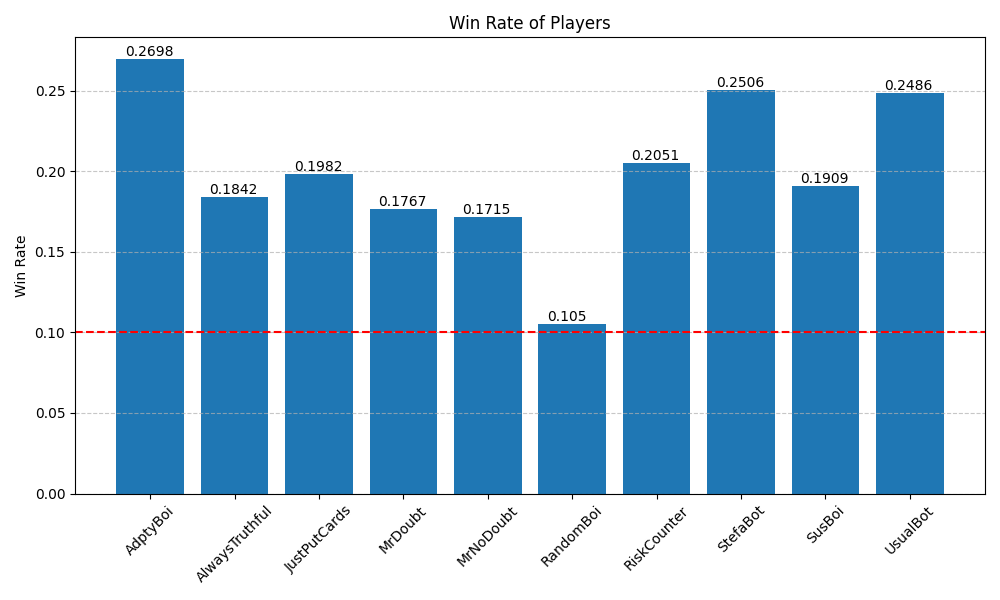

We can also examine the remaining cards per game:

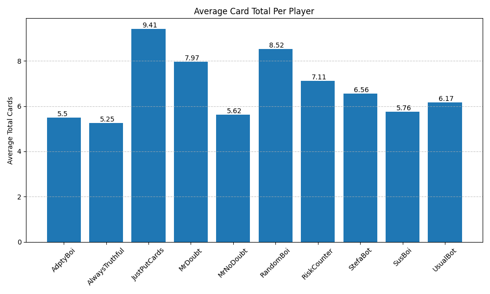

## Individual Results

Here, instead, we can observe the individual performance of each bot.

<div style="display: flex; align-items: center; margin-top: 40px; margin-bottom: 5px;">
    
    <div style="margin-left: 20px; font-size: 32px;">
        <p><b>RandomBoi</b></p>
    </div>
</div>

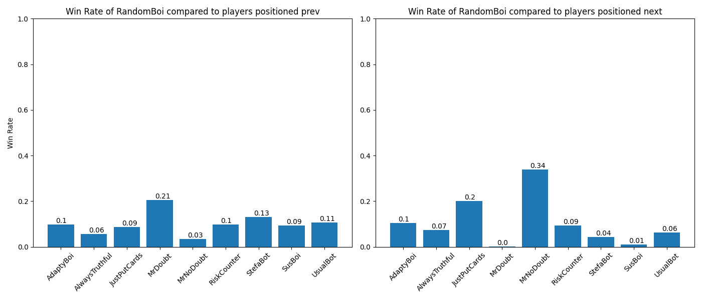

<div style="display: flex; align-items: center; margin-top: 40px; margin-bottom: 5px;">
    
    <div style="margin-left: 20px; font-size: 32px;">
        <p><b>AlwaysTruthful</b></p>
    </div>
</div>

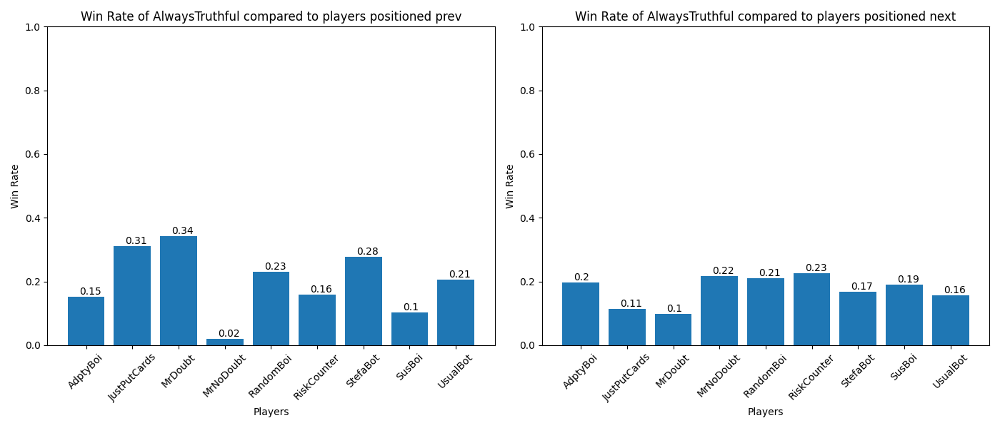

<div style="display: flex; align-items: center; margin-top: 40px; margin-bottom: 5px;">
    
    <div style="margin-left: 20px; font-size: 32px;">
        <p><b>MrNoDoubt</b></p>
    </div>
</div>

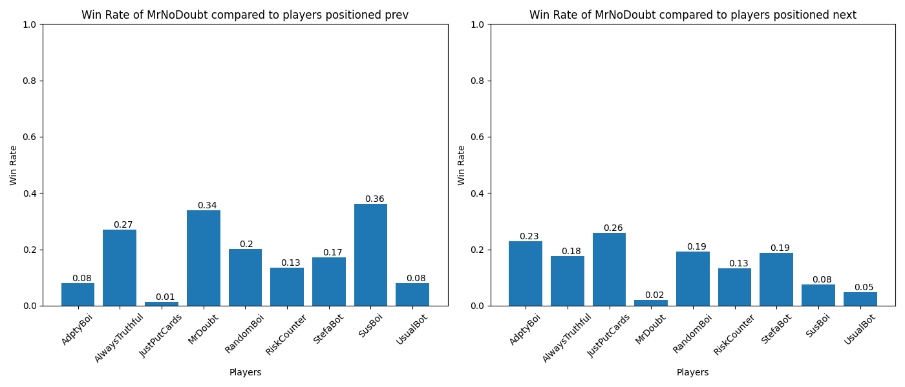

<div style="display: flex; align-items: center; margin-top: 40px; margin-bottom: 5px;">
    
    <div style="margin-left: 20px; font-size: 32px;">
        <p><b>JustPutCards</b></p>
    </div>
</div>

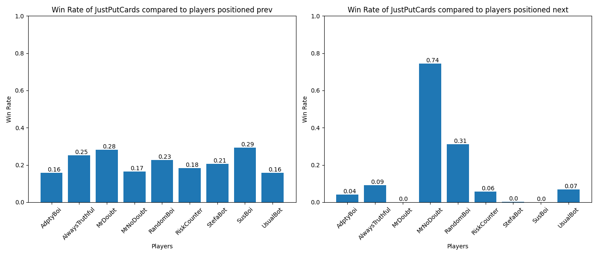

<div style="display: flex; align-items: center; margin-top: 40px; margin-bottom: 5px;">
    
    <div style="margin-left: 20px; font-size: 32px;">
        <p><b>AdaptyBoi</b></p>
    </div>
</div>

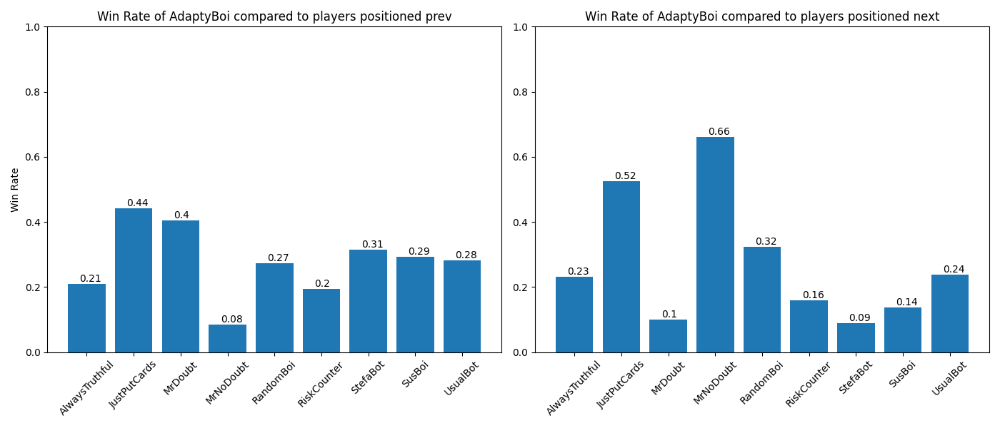

<div style="display: flex; align-items: center; margin-top: 40px; margin-bottom: 5px;">
    
    <div style="margin-left: 20px; font-size: 32px;">
        <p><b>SusBoi</b></p>
    </div>
</div>

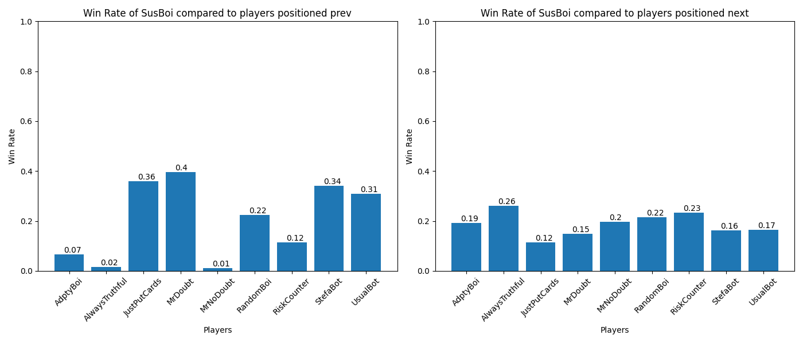

<div style="display: flex; align-items: center; margin-top: 40px; margin-bottom: 5px;">
    
    <div style="margin-left: 20px; font-size: 32px;">
        <p><b>UsualBot</b></p>
    </div>
</div>

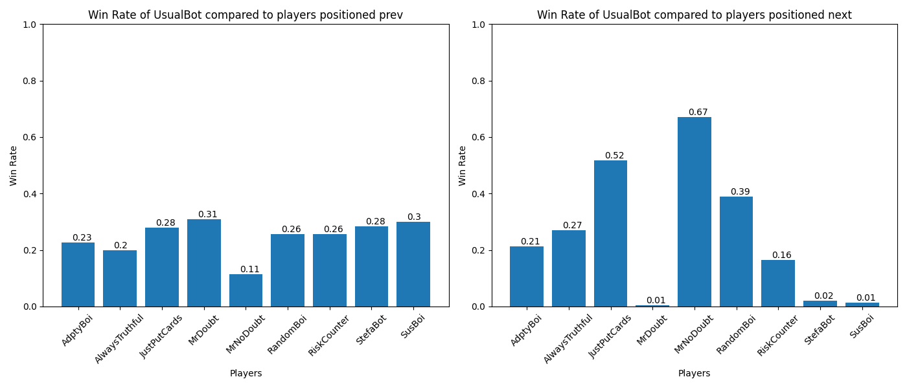

<div style="display: flex; align-items: center; margin-top: 40px; margin-bottom: 5px;">
    
    <div style="margin-left: 20px; font-size: 32px;">
        <p><b>RiskCounter</b></p>
    </div>
</div>

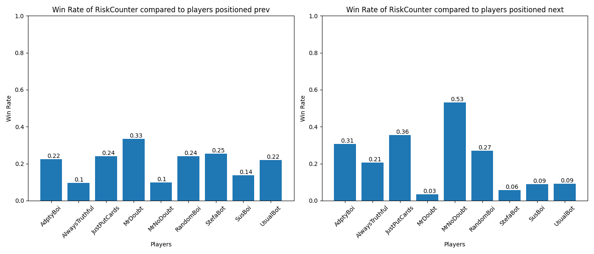

<div style="display: flex; align-items: center; margin-top: 40px; margin-bottom: 5px;">
    
    <div style="margin-left: 20px; font-size: 32px;">
        <p><b>StefaBot</b></p>
    </div>
</div>

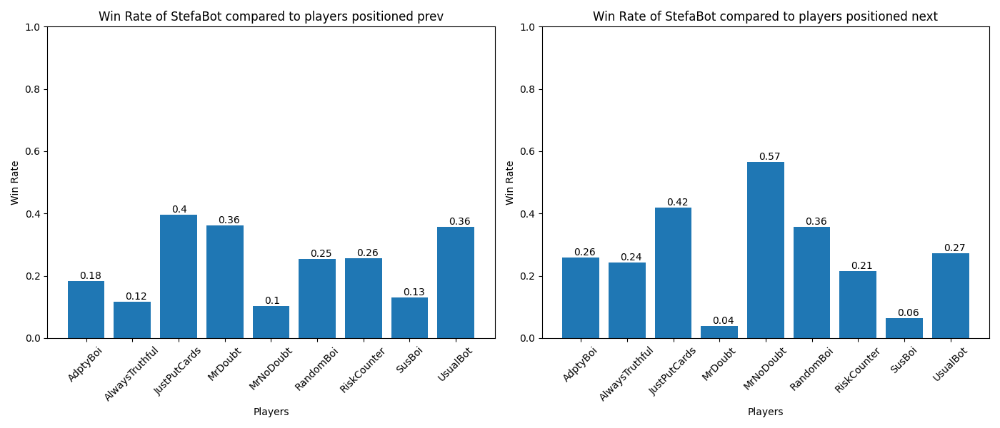

# Final Conclusion
- The game heavily depends on the chosen **position** at the beginning of the match and consequently on the players preceding and succeeding you. 
- As evident from the win rate graphs of each bot, there are delineations between "**aggressive**" bots (with a tendency to bluff) and "**passive**" bots (inclined to play honestly: doubting and playing cards associated with the correct number). Typically, aggressive bots exhibit greater variance in win rate concerning succeeding players, while passive bots show more variance concerning preceding players. Aggressive players need to pay closer attention to succeeding players, while passive ones focus on preceding players. 
- At present, the best algorithm appears to be **AdaptyBoi**, which strikes a good balance between aggressive and passive playstyles. Hence, identifying the strategies of the players around you is crucial and adapting accordingly. Unfortunately, there isn't a method capable of decisively winning against all types of opponents, considering the game's reliance on luck.